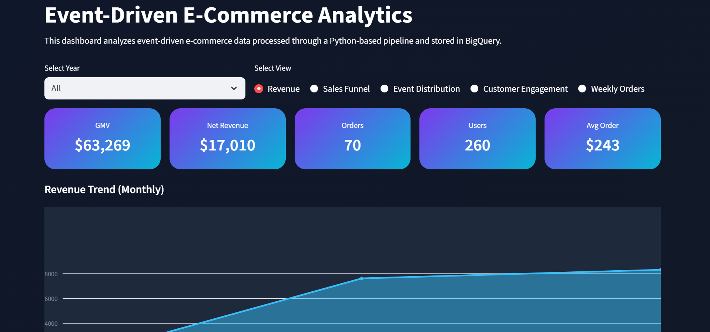
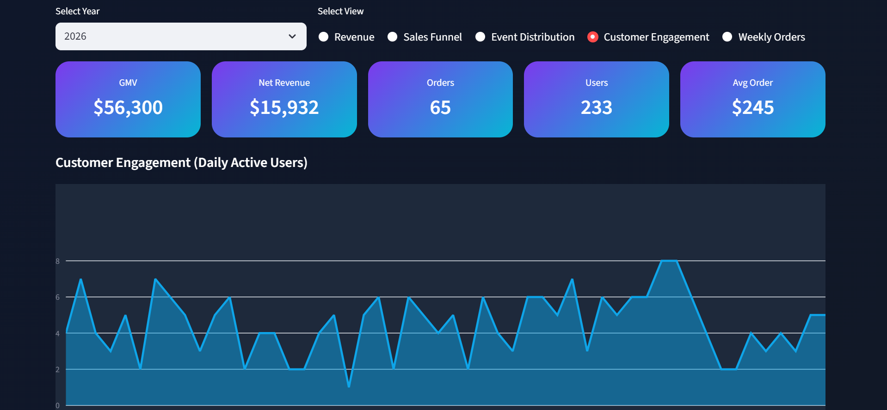
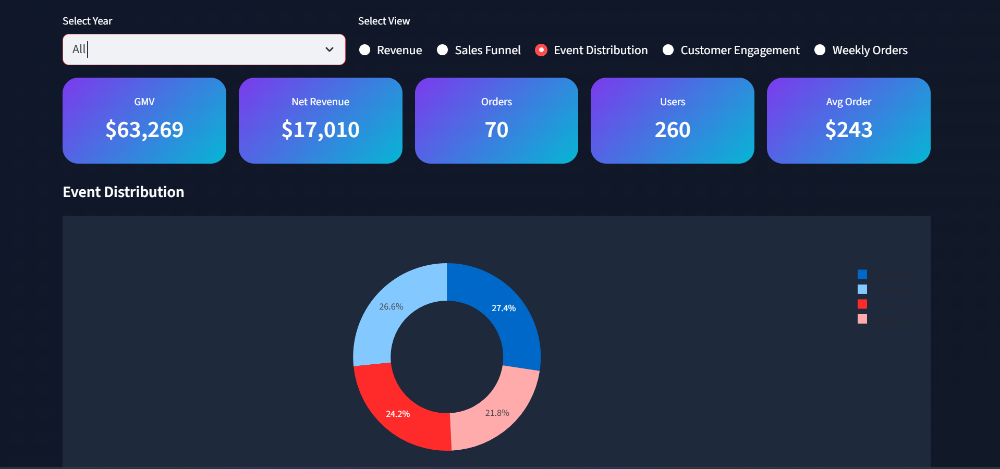

# Event-Driven E-commerce Dashboard

## Overview
This project implements a complete **Event-Driven Data Pipeline for E-commerce**. The system captures, processes, and analyzes user interactions and transactions from e-commerce platforms. The processed data is visualized in a **Streamlit dashboard** to monitor key performance metrics and the customer journey funnel.

---

## Features

- **Real-time & Historical Data Processing:**  
  Ingests synthetic events (via Faker) and historical order data from the Brazilian E-Commerce Public Dataset.

- **Data Pipeline:**  
  Python scripts process raw events, transform orders, and load data into **Google BigQuery**.

- **Data Marts:**  
  Specialized tables (e.g., `funnel_mart`) for analytical perspectives like funnel breakdown and KPI summaries.

- **Dashboard:**  
  Built with **Streamlit**:
  - Yearly KPIs (Revenue, Purchases, Active Users)
  - Revenue Over Time (last 10 years)
  - Funnel Breakdown with conversion rates
  - Simple and professional UI with dark/light theme support

- **Robust Practices:**  
  - Incremental loading support in ETL scripts  
  - Error handling during ingestion and transformations  
  - Large file handling with **Git LFS**  

---

## Tech Stack & Tools

| Component | Tool/Technology |
|-----------|----------------|
| Data Generation | Python, Faker |
| Data Storage | Google BigQuery |
| ETL | Python (pandas, CSV) |
| Dashboard | Streamlit, Plotly |
| Version Control | Git, GitHub |
| Large File Support | Git LFS |
| Dataset | Brazilian E-Commerce Public Dataset |

---

## File Structure
├── dashboard/
│ ├── app.py # Streamlit dashboard code
│ └── streamlit/
│ └── config.toml # Streamlit config for theme
├── data/ # Source & processed CSV files
├── events/
│ └── event_generator.py # Generate synthetic events using Faker
├── pipelines/
│ ├── load_to_bigquery.py
│ ├── process_events.py
│ └── test_bigquery_connection.py
├── scripts/
│ ├── explore_data.py
│ └── transform_orders.py
├── .gitignore
└── README.md


---

## Setup Instructions

### Prerequisites
- Python >= 3.10
- Google Cloud account with BigQuery access
- Git & Git LFS
- Streamlit

### Installation
```bash
# Clone the repository
git clone https://github.com/BNVR/event-driven-ecommerce-dashboard.git
cd event-driven-ecommerce-dashboard

# Install dependencies
pip install -r requirements.txt

# Install and initialize Git LFS
git lfs install
git lfs track "*.csv"

# Run the dashboard
streamlit run dashboard/app.py


<p align="center">
  
</p>

<p align="center">
  
</p>

<p align="center">
  
</p>

